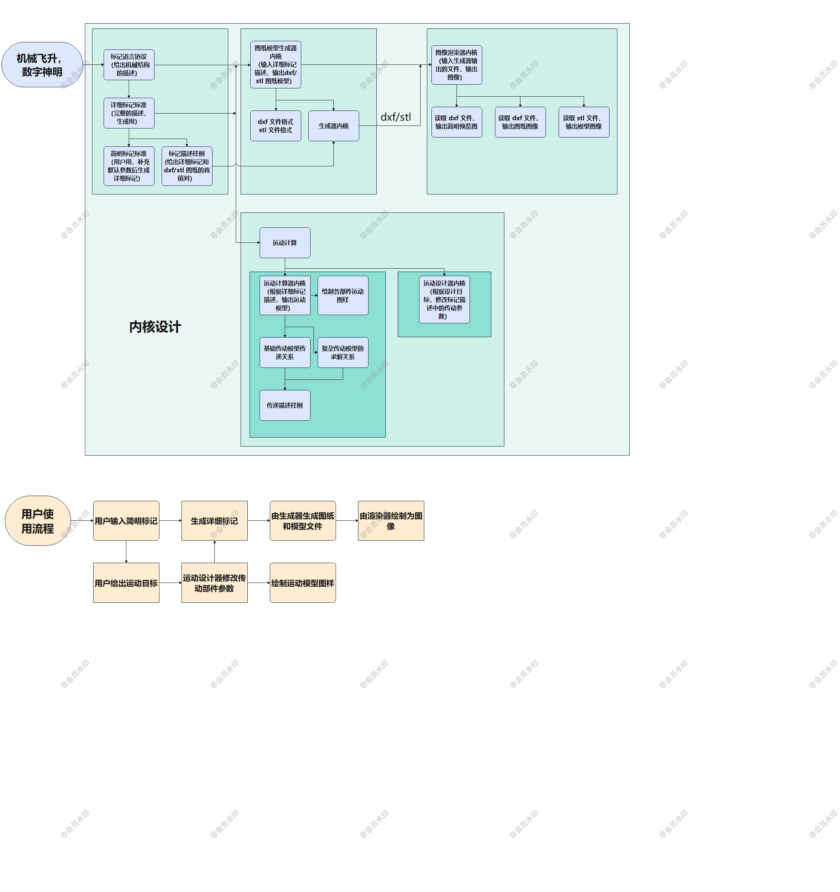

# 预赛资料

## 1. Introduction

### 1.1 机械设计

* 机械：一个组装的零件系统，可以以预定和受控的方式传递运动和能量。是能够控制力和运动的系统。
* 机械设计：机械设计研究如何创造机械，以使其安全、可靠地工作的内容。
* 机械设计的本质：一台机器的基本功能是做有用功，机器或多或少会涉及能量的传递和转换，当能量发生传递和转换时，机器就产生了运动和力。通过分析和计算这些运动、力、能量的变化，以确定机器中的各个相关零部件的尺寸、形状、材料、工艺等参数，从而使机器能够正常工作。
* 机械建模：

&emsp;&emsp;由于信息技术的发展，基于建模的设计方法开始盛行，其相较于传统开发方式的优点有：

1. 基于模型的设计提供了一个共同的开发环境，有利于不同开发团队之间的一般性沟通、资料分析及系统验证。
2. 工程师可以在系统设计早期定位出错误并修正错误，此时系统修改造成的时间冲击和对财务的影响是最小的。
3. 设计可以复用，有助于提升技能及衍生系统的扩充能力。

&emsp;&emsp;机械设计与机械建模是不同的过程。设计时一种在思考时决定形状的过程，建模是构建固定形状的过程。

机械建模往往采用自下而上的方式，即先设计零部件，然后组装成装配体，最后组装成产品。在建模的过程中要求设计者对每个零件给出确定的尺寸、形状、材料等参数。

机械设计则可以分为两种不同的设计方法论：自下而上（Bottom-Up）和自顶至底（Top-Down）设计。（还原论与衍生论）

* 自顶至底的设计方法（又称逐步细化法）本质上是从设计目标出发对设计系统**递归地**进行分解细化，直到得到最小的功能单元和零部件。采用了“分而治之”的思想。是设计人员从功能性考虑出发时采用的设计方法，通常用于设计和开发新产品。
  * 其特点为：由整体视角驱动、能达到系统级的整体优化、适用于复杂或新的未清晰定义的产品，整个设计一直受到产品最终需要达到的功能的约束，通常需要更多的模型仿真来优化设计。
* 自下而上的设计方法是将系统拼接在一起以产生更加复杂的系统，从而使原系统成为新系统的子系统。采用自下而上的方法时，首先会对系统的基本元素详加规定，然后将这些元素**递推的**链接在一起以形成更大的子系统，然后依次将他们链接起来，直到形成完整的顶层新系统。是当设计目标已大体成型，而当所选定的组件是现成或现有的时候，就会采用自下而上方法将其集成到产品中。可以降低成本和提高组件可用性。

&emsp;&emsp;目前有许多计算机仿真设计软件（CAD）可以帮助设计人员完成机械建模。这些软件在使用过程中采用了自下而上的建模方式，即零部件——子装配体——父装配体——最终产品的建模顺序。而这样的流程一定程度与上与自顶至底的设计方法相悖。这使得在设计装配草图时无法及时通过建模验证功能效果，从而增加了反复迭代过程中的设计成本。对于那些机械设计经验不多、但却有着**明确设计需求与约束**的用户来说，这样的设计流程显然是不适合且门槛高的。

&emsp;&emsp;我们希望能够创造出一款能够能够辅助自顶至底设计流程的机械设计辅助开发环境，达到放缓机械设计陡峭的学习曲线、提高设计效率的目的。

初步开发流程如下：

## 2. related works

### 2.1 机械设计CAD软件概述

1. **AutoCAD**
$~~~~~~~$AutoCAD是由Autodesk公司开发的一款著名计算机辅助设计（CAD）软件，主要应用于二维绘图和基础的三维设计，主要功能为二维绘图和细化，同时也支持基础的三维建模，具有较高的自定义和扩展性，以及与其他Autodesk设计工具的互操作性，目前广泛应用于工程设计、建筑规划和设计、制图和文档、室内设计和规划等场景。

* 官网网址：<https://www.autodesk.com.cn/products/autocad/overview?term=1-YEAR&tab=subscription>

2. **SolidWorks**
$~~~~~~~$SolidWorks是一款专业的三维计算机辅助设计（CAD）和计算机辅助工程（CAE）软件，由Dassault Systèmes公司的子公司SolidWorks Corp开发。其核心功能为参数化的三维设计，同时允许用户创建零件和装配体等不同层次的设计。在三维建模设计之外，SolidWorks也提供了生成二维工程图的工具，以及各种仿真分析工具，此外，也提供了对模型进行可视化展示与渲染的工具。目前被广泛应用于机械设计、产品设计、航空航天、汽车等各领域的装备设计中。

* 官网网址：<https://www.solidworks.com/>

3. **CATIA**
$~~~~~~~$CATIA（Computer Aided Three-dimensional Interactive Application）是由法国Dassault Systèmes公司开发的一款高级计算机辅助设计（CAD）、计算机辅助制造（CAM）和计算机辅助工程（CAE）软件。除了和前述设计软件一样具有强大的参数化三维建模、仿真分析等优点外，其还具有集成了PLM（产品生命周期管理）、便于多用户协作与数据管理等优点，目前主要应用于航空航天、汽车工业等复杂机械系统和设备的设计中。

* 官网网址：<https://www.3ds.com/zh/products-services/catia/>

4. **Inventor**
$~~~~~~~$Inventor也是由Autodesk公司开发的一款专业的计算机辅助设计（CAD）软件，与AutoCAD不同，其主要应用于三维模型设计，且较前述三维设计软件来说更为轻量直观，更易于上手。

* 官网网址：<https://www.autodesk.com.cn/products/inventor/overview?term=1-YEAR&tab=subscription>

5. **OpenSCAD**
$~~~~~~~$OpenSCAD是一种与众不同的三维建模软件，与传统的交互式建模软件有显著的不同，因为它不提供直观的图形界面进行模型的拖拽和编辑，而是使用一种类似于编程的方法来描述对象。
$~~~~~~~$OpenSCAD使用类似于编程的脚本语言来定义对象，用户通过编写代码来指定对象的尺寸、形状、操作和关系，从而构建三维模型，这种基于代码的方法使得创建精确的、参数化的模型变得简单。它特别适合需要精确控制的工程和科学项目。

* 官网网址：<https://openscad.org/>
