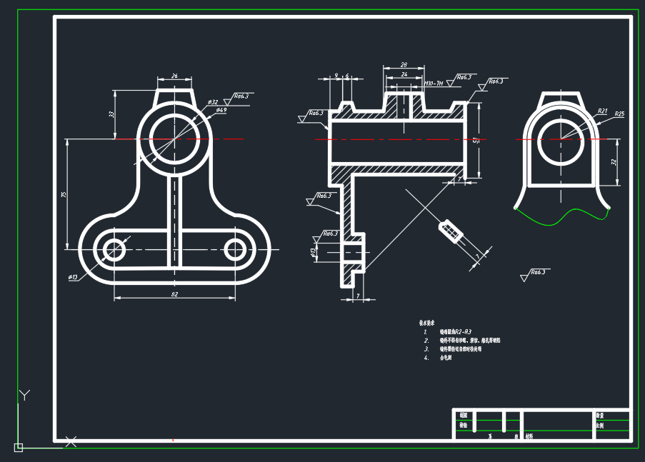
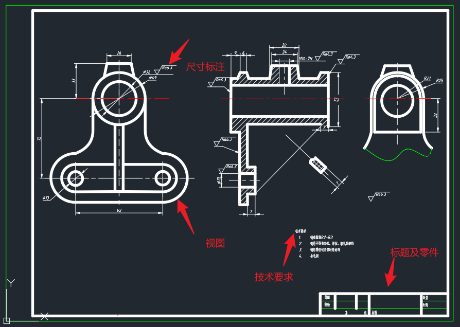
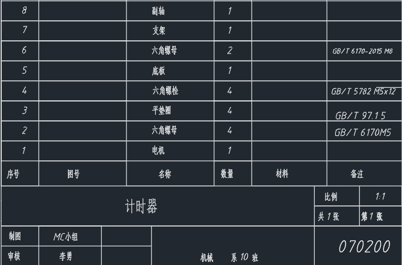

# 绘图标准

## 绘图要求

一张机械图纸应该包括以下四个内容：完整的视图展示、尺寸标注、技术要求、标题及零件清单。

### 视图展示

在确认视图的过程中，往往沿着装配线展开视图，从而在部分情况下需要将零件“切开”以展示内部结构，这种绘图的展现方式称为剖视，常常在回转结构等部件上使用。

采用部分视图的情况下可能产生歧义，尤其在存在重要结构被遮挡的情况下，此时需要结合多个视图来展现一个结构。此时以表达信息量最大的一张图作为主视图。一般来说，用最少的视图来展现一个完整的结构是设计绘图者的至高追求。

### 尺寸标注

尺寸描述零件的几何尺寸和相对位置等重要信息，描述了各个零件的定形、定位信息。一般来说，尺寸链秉持的原则是不重复、不遗漏、不矛盾。也即对于同一个零件的定型定位信息应当只存在一种描述方式。

### 技术要求

技术要求一般以文字形式标注在图纸上，用于描述零件的加工要求、表面处理要求、装配要求等。

### 标题及零件清单

标题及零件清单是图纸的附属信息，用于描述图纸的基本信息和零件的数量、名称等。

## 图层与线型规范

在绘图过程中要求不同性质的线条处于不同的图层中，同时采用不同的线形，一般来说要求如下：

| 线型     | 线宽    | 线色     | 用法     |
|----------|---------|---------|----------|
| 粗实线   | 0.5mm   | 白底用黑色，黑底用白色 |轮廓边缘、断面处|
| 细实线   | 0.3mm/0.25mm | 白底用黑色，黑底用绿色 |部分功能性线条|
| 虚线     | 同细实线 | 黄色      |看不见的边缘、断面处|
| 剖面线   | 同细实线 | 同细实线 |剖面区域|
| 尺寸标注线 | 同细实线 | 白底用黑色，黑底用白色 |尺寸标注处|
| 文字标注线 | 同尺寸标注线 | 同尺寸标注线     |文字标注处|
| 点画线   | 同细实线 | 红色       |轴线、中心线、省略螺纹孔，通常表示轴对称性|

## 样例

一张示例图纸如下：

我们可以轻易找到其上的四个部分

其中技术要求以文本形式标注在图纸上即可。汉字一般采用宋体，字体宽高比为2：3，字号一般为3.5mm.

其中标题栏主要列举图纸名称、绘图人、图纸日期、比例等信息，零件清单就是一个表格，列举图纸中的零件及数量，标准件一般需要标注国标号，一个更好的例子为：

字号与技术要求一致。

视图展示与尺寸标注是图纸的核心部分，也是最复杂的部分。

首先需要留意的是线型，各线型与颜色见上表。构件的轮廓线一般采用粗实线，部分功能性线条采用细实线，看不见的边缘、断面处采用虚线，剖面区域采用剖面线，尺寸标注处采用尺寸标注线，文字标注处采用文字标注线，轴线、中心线、省略螺纹孔等处采用点画线。

尺寸标注的详细说明见 `尺寸标注.pptx` 这里只做简单说明。
