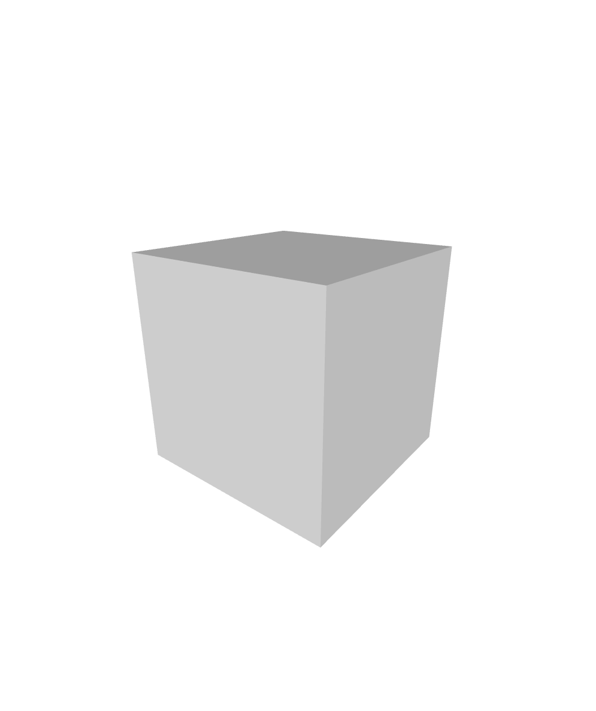
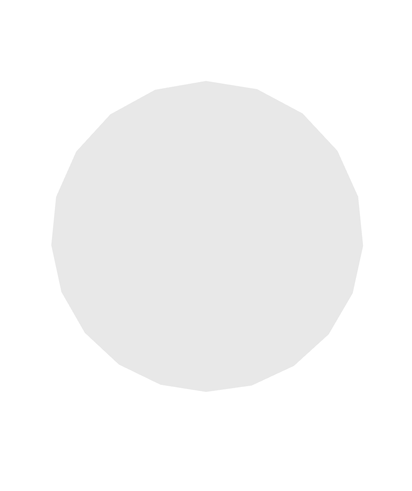
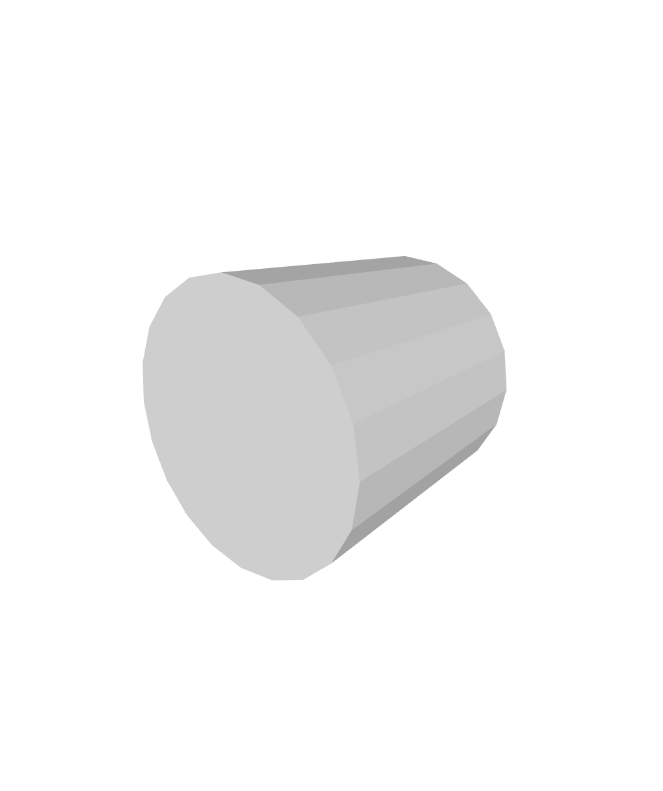
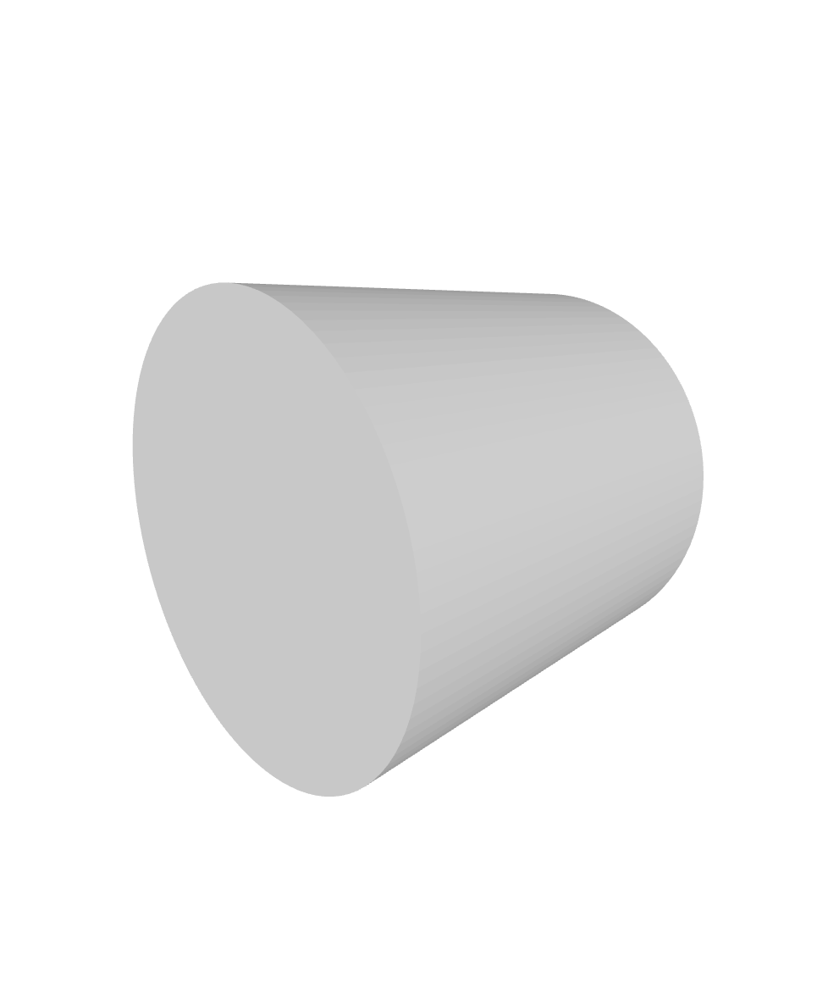

# obj

## 概念

&emsp;&emsp;OBJ文件是Wavefront公司为它的一套基于工作站的3D建模和动画软件"Advanced Visualizer"开发的一种文件格式，这种格式同样也以通过Maya读写。OBJ文件是一种文本文件，可以直接用写字板打开进行查看和编辑修改。

## 基本结构

&emsp;&emsp;OBJ文件不需要任何种文件头(File Header)，尽管经常使用几行文件信息的注释作为文件的开头。OBJ文件由一行行文本组成，注释行以一个“井”号(#)为开头，空格和空行可以随意加到文件中以增加文件的可读性。有字的行都由一两个标记字母也就是关键字(Keyword)开头，关键字可以说明这一行是什么样的数据。多行可以逻辑地连接在一起表示一行，方法是在每一行最后添加一个连接符(\)。

## 常用关键字
v 几何体顶点 (Geometric vertices)

vt 贴图坐标点 (Texture vertices)

vn 顶点法线 (Vertex normals)

vp 参数空格顶点 (Parameter space vertices)

p 点 (Point)

l 线 (Line)

f 面 (Face)

curv 曲线 (Curve)

o 对象名称 (Object name)

## 示例
1. **正方体**
```
# This is a cube
v -1 -1 -1
v 1 -1 -1
v 1 1 -1
v -1 1 -1
v -1 -1 1
v 1 -1 1
v 1 1 1
v -1 1 1
vn 0 0 -1
vn 0 -1 0
vn 1 0 0
vn 0 1 0
vn -1 0 0
vn 0 0 1
f 1//1 2//1 3//1 4//1
f 1//2 2//2 6//2 5//2
f 2//3 3//3 7//3 6//3
f 3//4 4//4 8//4 7//4
f 4//5 1//5 5//5 8//5
f 5//6 6//6 7//6 8//6
```
&emsp;&emsp;第一行以#开头，为注释行
&emsp;&emsp;此后8行为v关键字开头，作用为定义顶点，后续三个参数为顶点的$x,y,z$坐标，分别以空格隔开
&emsp;&emsp;此后6行以关键字vn开头，定义了6个顶点法向量（该定义为计算机图形学知识，感兴趣可自行百度）
&emsp;&emsp;此后6行以关键字f开头，定义了正方体的6个面。f后参数格式为：几何顶点索引/贴图坐标索引/顶点法向量索引，其中索引数即该类定义中该定义的次序。该例子中并未定义贴图坐标，故参数中第二项缺省。更一般的，若并未定义顶点法向量，f后参数可仅写几何顶点索引，将“/”也一并省去。需要注意的是，f后各顶点应以逆时针次序围成平面，一般以3-4个点为宜。
&emsp;&emsp;该obj文件绘图效果如下：

2. **圆形**
&emsp;&emsp;对于光滑曲线（面），常用的绘图方法是使用多边形进行近似逼近。
&emsp;&emsp;example文件夹中的circle.obj文件为生成圆形的示例代码，其中定义了圆心及20个圆上点，用三角形拼成正20边形从而近似绘出圆形，绘图效果如下：

3. **圆柱**
&emsp;&emsp;圆柱画法与圆形类似，首先需要画出两个圆形，然后圆柱面以矩形拼接近似生成。
&emsp;&emsp;example文件夹中的cylinder.obj文件为生成圆柱的示例代码，绘图效果如下：
&emsp;&emsp;可以看出此时该圆柱较为粗糙，进一步提升精度可以通过用更多的点来逼近做到。example文件夹中的cylinder2.obj文件中用100个点近似生成圆形进而生成圆柱，绘图效果如下：